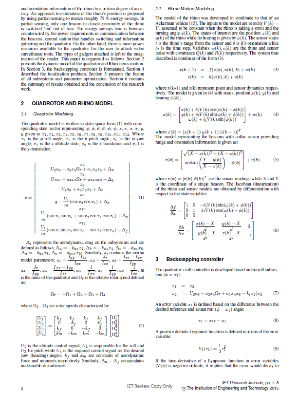
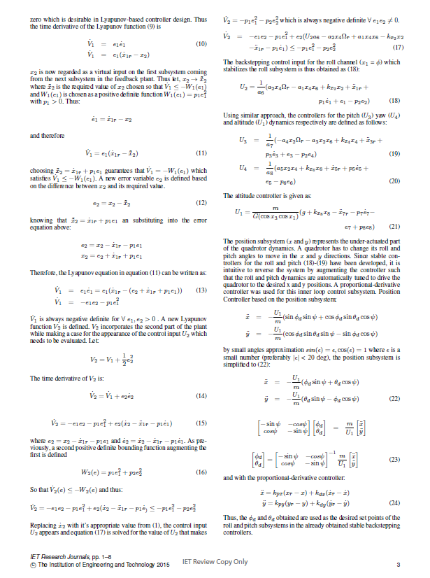
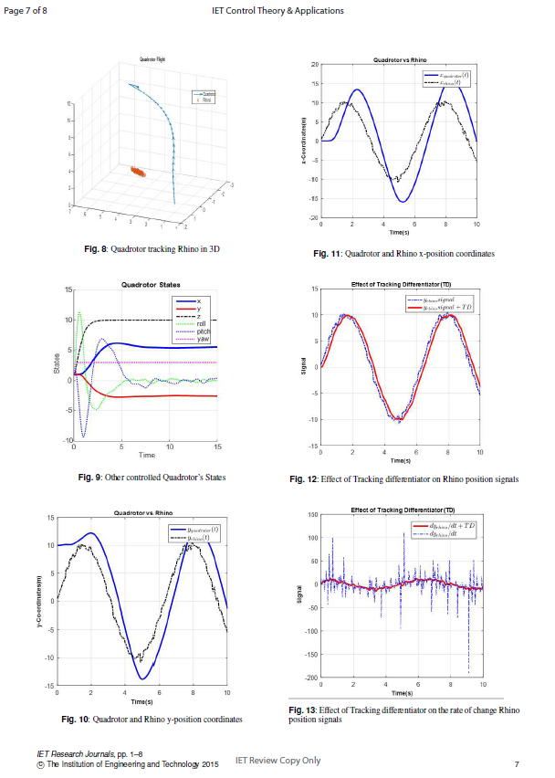

# Endangered Species Tracking : EKF with Backstepping+PD Control  
  
## Introduction  

Backstepping and Proportional-Derivative (PD) methods was used for the control of a quadrotor unit and subsequently proposed for autonomous tracking of an endangered species; the ’Northern white rhino’. Extended Kalman Filter (EKF) estimation was applied for the localization of the rhino in a virtual wildlife reserve. 
  
  
## Description  
  
  
  
  
## Results  
  
  
